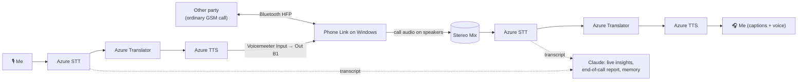

# DuyAI

**Live AI interpreter inside an ordinary phone call.** You make a normal GSM call from your own SIM. The other person installs nothing. They hear the AI speak your words in their language, and you see and hear theirs in yours. When the call ends, you get a structured report with one-click actions.

Submission to NeuroBridge.SI Baku, 9–10 October 2026.

> **▶ Live demo (no install): https://duyai-app.vercel.app**
>
> 1. Open it in Chrome or Edge and press **Start translation**. Allow the microphone and speak.
> 2. In the **Demo** panel, play the other party: tap an example line or type your own. The last line is a scam, so the red alert fires.
> 3. Optional: turn on **AI auto-answer** and write a short profile. The AI then answers the other party's questions for you.
> 4. Press **End call** to get the report with calendar and reminder buttons.
>
> The demo runs the full AI pipeline (Azure Speech + Translator + Claude). Only the parts that need the phone paired to a PC (the real GSM call, auto start) are listed at the bottom of the page and shown in the **2-minute video** (link in the submission).

**Results at a glance**

| Intent accuracy | Dates → exact ISO | Times    | Prices   | Commitment F1 | Automated tests | Languages |
| --------------- | ----------------- | -------- | -------- | ------------- | --------------- | --------- |
| **95.8%**       | **100%**          | **100%** | **100%** | **86.7%**     | **84 passing**  | **21**    |

<sub>Measured on our hand-labelled Azerbaijani test set (24 calls), see [§3](#3-quality-testing).</sub>

|                           |                                                                                                                                                                                                                                                                                                                                                                                                                                 |
| ------------------------- | ------------------------------------------------------------------------------------------------------------------------------------------------------------------------------------------------------------------------------------------------------------------------------------------------------------------------------------------------------------------------------------------------------------------------------- |
| **Who it is for**         | People who must handle a real phone call in a language they do not speak: migrants and students abroad, small businesses taking calls from foreign clients, older people dealing with banks and clinics, travellers booking hotels or taxis.                                                                                                                                                                                    |
| **What goes wrong today** | Phone calls are the hardest place for language barriers. Translator apps work face to face, not inside a call. Speakerphone plus a translator app is slow and awkward, and the other side hangs up. A human interpreter costs money and has to be booked. Afterwards, nobody remembers exactly what was agreed (date, time, price, who promised what). Phone scams also target people who do not fully understand the language. |
| **What this does**        | It sits in the audio path of a real call. Speech recognition, translation and a synthetic voice run in both directions. The other party's speech is shown as live captions. After the call, Claude extracts the intent, dates, times, prices and promises into calendar, reminder and map actions. A scam guard warns during the call.                                                                                          |

> **Where to find each scoring criterion:** value for the user, [Problem](#1-value-for-the-user) · prototype and use of AI, [How it works](#2-prototype-and-use-of-ai) · quality testing, [Testing](#3-quality-testing) · feasibility, [Costs and next step](#4-feasibility) · originality, [What is different](#5-originality) · [Why we stand out](#why-duyai-stands-out) · [Models, data and components (disclosure)](#models-data-and-components-used) · [Setup](#setup)

---

## 1. Value for the user

**Core scenario:** an Azerbaijani speaker calls a Russian-speaking landlord, clinic or hotel.

1. They dial from their own phone as usual. The phone is paired to a Windows PC via Microsoft **Phone Link**.
2. The app **starts by itself** when the call starts, using Windows' own call signal. It holds back the caller's words until the other side says "alo".
3. The caller speaks Azerbaijani. Within seconds, the other side hears a natural Russian voice.
4. The other side answers in Russian. The caller sees a live transcript with an Azerbaijani translation and can also hear it spoken.
5. When the call ends, the report opens automatically. For example: _"Viewing on Saturday 10 Oct 18:00, rent 600 AZN, landlord sends the address by SMS"_. It has buttons for **Google Calendar**, **.ics** (Outlook/iPhone), **reminder**, **map** and an **e-mail draft**.

**Outcome for the user:**

- They can make the call at all, without an interpreter, and the other party does not need any app.
- Agreements are not lost. "Sabah", "cümə", "saat 3-də" are resolved to exact dates and times, measured at 100% on our test set.
- They get warned before giving away an SMS code or card number.

> **What sets it apart:** the value comes during the call and after it. Most tools stop at translation. Here, a single call also leaves you with exact dates, a calendar event, a reminder for your promise and a scam warning. The user needs nothing new: their own phone and number. The other party needs nothing at all.

## 2. Prototype and use of AI

### Working today (tested on real GSM calls, Phone Link + Android)

| Feature                                                                                                                                                                           | What AI contributes                                                                                                                                                                                                                                                                |
| --------------------------------------------------------------------------------------------------------------------------------------------------------------------------------- | ---------------------------------------------------------------------------------------------------------------------------------------------------------------------------------------------------------------------------------------------------------------------------------- |
| **Two-way live translation** in **21 languages** (AZ, RU, EN, TR, DE, FR, AR, ES, IT, PT, ZH, JA, KO, HI, FA, UK, KK, UZ, PL, NL, HE), each with a female and a male neural voice | Azure Speech recognizes speech continuously. **Azure Translator** translates each phrase in about 0.4–0.7 s. **Azure neural TTS** speaks the result into the call. With `TRANSLATION_ENGINE=claude`, **Claude** translates with conversation context and fixes recognition errors. |
| **Call Intelligence report**                                                                                                                                                      | **Claude** (structured JSON output) extracts intent, entities, agreements, **commitments (who promised what, by when)**, open questions and ready-to-use actions. Relative dates are resolved against the real call time and time zone.                                            |
| **Live insights panel**                                                                                                                                                           | **Claude** updates topic, dates, prices, addresses and promises as cards while the call is running.                                                                                                                                                                                |
| **Scam guard**                                                                                                                                                                    | Two layers. An instant keyword check in 6 languages (0 ms) runs in every mode. In Claude mode, **Claude** also rates risk in context (e.g. "we are the bank, your account is blocked") and blocks any AI auto-reply to risky questions.                                            |
| **AI auto-answer (optional, Claude mode)**                                                                                                                                        | **Claude** answers simple questions for the caller from a user-written profile. It never invents personal data and never agrees to payments or commitments. Such questions are passed to the user.                                                                                 |
| **Phone viewer (QR)**                                                                                                                                                             | Scan a QR code and the live call opens on the phone: big captions of the other party in your language, translations and a red scam alert. It is read-only, works on the same Wi-Fi only and is protected by a token that changes on every start.                                   |
| **Call memory**                                                                                                                                                                   | Each call is saved locally. The number is read from Phone Link's call history. When the same number calls again, earlier calls and open promises appear in the report.                                                                                                             |
| **Automation**                                                                                                                                                                    | Auto start and stop from the Windows call signal, answer gating, the other party's language picked from the country code (+7 → RU, +90 → TR, …), echo and bleed guards, mute button (key **M**).                                                                                   |
| **Bilingual interface**                                                                                                                                                           | English / Azerbaijani with one click (EN · AZ); English by default, the choice is remembered.                                                                                                                                                                                      |
| **Online demo mode**                                                                                                                                                              | The same app on Vercel without any call hardware: the visitor speaks into the microphone and plays the other party by typing, with rate limits and daily caps that protect the API budget.                                                                                         |

> **What sets it apart:** AI is the core of every step, not a feature on top. Speech recognition, translation and synthesis run in both directions. Claude turns a conversation into structured actions. And the system is engineered for real calls: auto start from the Windows call signal, answer gating, echo/bleed guards, network retries, a provider fallback and a diagnostics log. It was debugged on real GSM calls, not only in a demo.

### Architecture



- **Frontend:** React 19 + TypeScript (strict) + Vite. The browser runs the Azure Speech SDK directly. The server only issues 10-minute tokens, so the Azure key never reaches the browser.
- **Backend:** Node.js + Express. It handles translation, Claude calls, call memory, the Windows call detector and diagnostics. Non-local hosts are blocked except the optional Twilio webhooks.
- **Reliability:**
  - Network drops are retried automatically.
  - If Claude fails (e.g. no credit), translation falls back to Azure, so the call never stops.
  - A diagnostics log records audio levels, the source device and dropped phrases with reasons.

### Our own small model (experiment)

`training/` fine-tunes **Qwen2.5-1.5B-Instruct with QLoRA** on a Kaggle T4. The goal is the call-understanding task (intent, dates, times, prices, commitments), with offline and private use in mind. The training data is synthetic Azerbaijani calls generated by Claude. The model is evaluated on the same hand-labelled test set as Claude. Results are in [§3](#3-quality-testing).

## 3. Quality testing

### 3.1 Call understanding: hand-labelled test set

`eval/dataset.mjs` contains **24 Azerbaijani phone conversations written and labelled by hand**. They are colloquial and mixed with Russian, English and Turkish words, and cover 11 intents including 2 scam calls. The test set is never used for training: the generator checks every training example against it. Run it with `npm run eval`. Raw outputs are in `eval/results/`.

| Model                                        | Intent    | Dates → ISO | Times    | Prices   | Commitment F1               |
| -------------------------------------------- | --------- | ----------- | -------- | -------- | --------------------------- |
| **Claude Opus 5.5** (the app's own pipeline) | **95.8%** | **100%**    | **100%** | **100%** | **86.7%** (P 76.5%, R 100%) |
| Qwen2.5-1.5B, base (no training)             | 58.3%     | 20.8%       | 50.0%    | 53.3%    | 0.0%                        |
| Qwen2.5-1.5B + LoRA, 25 synthetic examples   | 50.0%     | 33.3%       | 88.9%    | 100%     | 41.1%                       |

**What the numbers say:**

- Claude finds every date, time and price.
- Claude's weak spot is **commitment precision**: it sometimes lists an extra, implied promise.
- With only 25 examples ($0.45 of data), the small model went from 0% to 41% on commitments and from 53% to 100% on prices. Intent dropped (58% → 50%) because 25 examples spread over 11 intents is too few.

### 3.2 Scam guard and logic: unit tests

There are **84 automated tests** (`npm test`, Vitest), all passing. They include:

- **Scam detector:** 16 labelled phrases in AZ, RU, EN and DE. All 10 scam phrases are flagged (SMS code, card number, CVV, PIN, password, AnyDesk). None of the 6 normal phrases is flagged (prices, names, "I will send you an SMS confirmation").
- **Other areas:** date/time to calendar conversion, `.ics` generation, phone-number → language detection for 30+ calling codes, English/Azerbaijani interface texts, the phone viewer's access check, audio-device selection and feedback-loop validation, the Twilio signature check, G.711 encoding and network retry.

Static checks: `npm run typecheck` (TypeScript strict) and `npm run lint` (ESLint) are clean.

### 3.3 Failures we found in real calls, and what we did

| #   | Failure (observed on real calls / tests)                                                                                 | Fix                                                                                                                                 |
| --- | ------------------------------------------------------------------------------------------------------------------------ | ----------------------------------------------------------------------------------------------------------------------------------- |
| 1   | Windows does not expose the phone's Bluetooth call audio to the browser, so the other party's audio level was 0          | Capture it from **Stereo Mix**, chosen automatically. The app switches to the Bluetooth device if it appears.                       |
| 2   | The AI voice spoken to the user was captured again and "translated" as the other party (_"Right, right, right, Salaam"_) | The echo guard now covers both AI outputs when the input is a loopback device. Headphones are recommended.                          |
| 3   | Automatic language detection labelled an Azerbaijani speaker as Turkish and AI speech as English                         | The language is fixed for the whole call: picked from the country code or by hand.                                                  |
| 4   | Names misrecognized by speech recognition ("Elgün" → "ölcüm")                                                            | Open. Plan: a custom phrase list / glossary.                                                                                        |
| 5   | Azure Translator dropped a word: "Sabah saat doqquzda görüşək" → "Увидимся в 9:00 утра" ("tomorrow" lost)                | Known trade-off. Claude mode keeps context and is more accurate but slower (about 2.2–2.7 s vs 0.4–0.7 s for the translation step). |
| 6   | Short Wi-Fi drops failed the call start ("fetch failed")                                                                 | Automatic retries for the Azure token and translation requests.                                                                     |
| 7   | A Bluetooth headset in Hands-Free mode blocks the phone's call channel                                                   | The app shows a validation error and prefers the headset's Stereo profile.                                                          |
| 8   | Claude rent-1 case: a viewing appointment classified as `appointment` (expected purchase/other)                          | Accepted. It is arguably ambiguous, and it is left in the test set as a failure.                                                    |

> **What sets it apart:** we publish our failures next to our scores. We report a hand-made Azerbaijani test set, a trained baseline (Claude vs a small open model before and after fine-tuning), unit tests for the safety-critical scam detector, and a list of real-call failures with the fix for each.

### 3.4 Comparison with how it is done today

|                                  | Speakerphone + translator app                | Human interpreter         | **DuyAI**                                                                                      |
| -------------------------------- | -------------------------------------------- | ------------------------- | ---------------------------------------------------------------------------------------------- |
| Works inside a normal phone call | Partly (awkward, the phone is passed around) | Yes (three-way call)      | **Yes**                                                                                        |
| Other party needs anything       | Patience                                     | No                        | **No**                                                                                         |
| Cost                             | Free                                         | Expensive, must be booked | **Cents per call** (see §4)                                                                    |
| Delay per phrase                 | Manual, often 5–10 s                         | About 1–3 s               | **About 2.5–4.5 s measured end-to-end (Claude mode)**, translation step 0.4–0.7 s (Azure mode) |
| Written record and actions       | No                                           | No                        | **Yes**: report, calendar, reminders                                                           |
| Scam warning                     | No                                           | Maybe                     | **Yes**                                                                                        |

These delays were measured in the app's own UI during real calls with Claude translation (2.4–4.4 s). End-to-end delay with Azure Translator has not been measured separately yet. The columns for today's approaches are qualitative, not measured by us.

## 4. Feasibility

- **Data requirements:**
  - The core translation needs **no user data and no training**: it runs on general speech and translation models.
  - Personalization (auto-answer profile, call memory) stays on the user's PC in `data/calls.json`.
  - Evaluation uses 24 hand-labelled calls. The optional small model trains on synthetic data.
- **Running costs** (approximate, based on public list prices; free tiers cover a demo):
  - Azure Speech STT for 2 streams: about $1 per audio hour per stream.
  - Azure Translator: $10 per million characters, with a **free tier of 2M characters per month**.
  - Azure neural TTS: about $15–16 per million characters.
  - Claude report: one request per call.
  - **Estimated total: roughly $0.05–0.10 per call minute.** The only fixed cost is hosting.
- **What it needs today:**
  - Windows 10/11, Microsoft Phone Link with an Android phone.
  - Free VB-CABLE and Voicemeeter, Chrome or Edge.
  - Azure Speech and Translator (free tiers), and Claude for reports.
- **Clear next step:** move the layer from the user's PC **into the operator network (SIP/IMS)**. The same pipeline then runs as a carrier service ("press *1 for a live interpreter"). It works on any phone and needs no PC or cables. A Twilio-based phone-to-phone version is already implemented (`server/phone/`) but blocked by trial-account limits. After that:
  - an Android app with captions;
  - a glossary for names;
  - a larger training set so the offline model can handle call understanding on-device.

> **What sets it apart:** it can be used today with free tiers and consumer hardware. The path to scale needs no new invention: the same pipeline moves into the operator network. Costs scale with minutes used, not with fixed infrastructure.

### Funding plan (founders build the product, no salaries included)

| Round                | Amount       | Main uses                                                                                                                                        | Milestones                                                                                    |
| -------------------- | ------------ | ------------------------------------------------------------------------------------------------------------------------------------------------ | --------------------------------------------------------------------------------------------- |
| Pre-seed (12 months) | **$60,000**  | AI & cloud ($17k), operator pilot & first users ($17k), legal & compliance ($8k), Azerbaijani test data ($7k), test phones ($5k), reserve ($6k)  | Android app, operator pilot, 1,000 beta users, 100+ paying, delay under 2 s                   |
| Seed (18 months)     | **$450,000** | Sales & marketing ($135k), AI & cloud at scale ($135k), operator integration & security ($90k), own offline model ($45k), legal & reserve ($45k) | 2 operator contracts, 5,000 paying users, 50 business clients, $40–60k MRR, 60%+ gross margin |

### Support and programmes

- **Claude for Startups:** DuyAI was accepted into Anthropic's Claude for Startups programme during the hackathon.
- **Replit:** the team won a free 1-year Replit Core plan for the whole team.

These cover a large part of the AI and development costs in the first year (see the funding plan in the pitch deck).

### Business model

| Plan     | Price              | Minutes                  | What you get                                                          |
| -------- | ------------------ | ------------------------ | --------------------------------------------------------------------- |
| Free     | $0                 | 15 / month               | Voice translation (21 languages) + scam alerts (always free)          |
| Premium  | $11.99 / month     | 100 / month (+$0.17/min) | + live captions, call report and actions, call memory, AI auto-answer |
| Business | $49 / user / month | 300 / month (+$0.13/min) | + shared team memory, CRM export, team dashboard                      |

At about $0.07 cost per minute, the margin is about 40% on Premium and 57% on Business. Students get 50% off Premium. Plans are shown in the app (the $ icon); payments are not connected in the prototype.

### Growth potential

- **Carrier service:** a live-interpreter feature an operator can sell per minute or as a subscription. It works for every subscriber with any phone, landlines included.
- **Business calls:** hotels, clinics, travel agencies and call centres receiving foreign-language calls. The report and commitments plug into CRMs and calendars.
- **Accessibility:** the same live-caption pipeline without translation serves deaf and hard-of-hearing users on ordinary calls.
- **Fraud protection:** the in-call scam guard as a stand-alone product for banks and families, e.g. alerting a relative when an older person receives a suspicious call.
- **Languages and markets:** any language Azure Speech supports (100+) is a configuration entry (`shared/languages.json`). The offline model path supports privacy-sensitive users.

## 5. Originality

### Competitive landscape

| Feature                                                              | **DuyAI**             | Samsung Galaxy AI     | Google Translate (app) | Otter.ai            |
| -------------------------------------------------------------------- | --------------------- | --------------------- | ---------------------- | ------------------- |
| Live speech translation                                              | ✅                    | ✅                    | ✅                     | ❌                  |
| Two-way **phone call** translation                                   | ✅                    | ✅                    | ❌                     | ❌                  |
| Summary with actions (calendar, reminders, who promised what)        | ✅                    | ❌                    | ❌                     | ✅ meetings only    |
| **Works with any phone**, the other side installs nothing            | ✅                    | ❌ Galaxy phones only | ❌ not inside calls    | ❌ not inside calls |
| **Azerbaijani**, incl. speech mixed with Russian / English / Turkish | ✅ tested on 24 calls | ❌                    | partial                | ❌                  |
| **Scam alert during the call**                                       | ✅                    | ❌                    | ❌                     | ❌                  |
| Call memory (recognizes a returning number)                          | ✅                    | ❌                    | ❌                     | ❌                  |

<sub>Competitor columns reflect publicly described features at the time of writing; Google Pixel phones have call translation in the phone app, which is separate from the Google Translate app compared here.</sub>

**DuyAI is the only one that translates real calls on any phone, turns them into actions and warns about scams, in Azerbaijani.**

- **Inside the real call, not next to it.** Most translators are face-to-face apps or require both people to install the same app (VoIP). This works on an ordinary GSM call to any number, landlines included.
- **Built for Azerbaijani as it is spoken:** code-switching with Russian, English and Turkish words, tested on a hand-made Azerbaijani set.
- **More than translation:** commitments ("who promised what, by when") turn into calendar events. Call memory recognizes a returning number. The scam guard runs during the call, when it matters.
- **Honest engineering:** measured results, a published failure list, and a working fallback when the AI provider is unavailable.

> **What sets it apart:** the combination is the novelty. It runs inside an ordinary GSM call, the other party installs nothing, it handles Azerbaijani code-switching, and it turns a conversation into actions plus a live scam guard. We are not aware of a product doing all of these for Azerbaijani speakers.

---

## Models, data and components used

| Kind        | What                                                                                                                                                                                                                                                               | Used for                                                                                                             |
| ----------- | ------------------------------------------------------------------------------------------------------------------------------------------------------------------------------------------------------------------------------------------------------------------ | -------------------------------------------------------------------------------------------------------------------- |
| Model / API | **Azure AI Speech** (speech-to-text, neural text-to-speech), region UAE North                                                                                                                                                                                      | Recognition and the synthetic voice in both directions                                                               |
| Model / API | **Azure AI Translator** (free F0)                                                                                                                                                                                                                                  | Live translation (default engine)                                                                                    |
| Model / API | **Claude Opus 5.5** (`claude-opus-5-5`, Anthropic API)                                                                                                                                                                                                             | End-of-call report, live insights, contextual translation, auto-answer and risk rating (Claude mode), evaluation run |
| Model / API | **Claude Sonnet 5.5** (`claude-sonnet-5-5`)                                                                                                                                                                                                                        | Generating the 25 synthetic training calls                                                                           |
| Open model  | **Qwen2.5-1.5B-Instruct** (Alibaba, Apache-2.0) + LoRA                                                                                                                                                                                                             | Fine-tuning experiment on Kaggle T4                                                                                  |
| Data        | `eval/dataset.mjs`: 24 conversations written and labelled by our team                                                                                                                                                                                              | Test set (never used for training)                                                                                   |
| Data        | `training/data/train.jsonl`: 25 synthetic calls generated by Claude                                                                                                                                                                                                | Training set for the small model                                                                                     |
| Libraries   | React, React DOM, Vite, TypeScript, Express, `microsoft-cognitiveservices-speech-sdk`, `@anthropic-ai/sdk`, `dotenv`, `ws`, `cloudflared`, `qrcode`; Vitest, ESLint, Prettier, concurrently; Python: transformers, peft, bitsandbytes, accelerate, datasets, torch | Application, tests, training                                                                                         |
| Software    | Microsoft Phone Link, VB-Audio VB-CABLE and Voicemeeter (free), Windows Stereo Mix                                                                                                                                                                                 | Getting call audio in and out of the PC                                                                              |
| Service     | Twilio (optional phone-to-phone mode, trial account), Kaggle (GPU notebook), Vercel (hosting of the online demo)                                                                                                                                                   | Experiment and training                                                                                              |
| Tools       | Claude Code (AI coding assistant)                                                                                                                                                                                                                                  | Used during development                                                                                              |

---

## Setup

**Requirements:** Windows 10/11, Node.js 20+, Chrome or Edge, an Android phone with **Phone Link**, and Azure + Anthropic keys.

### 1. Install and configure (about 5 minutes)

```bash
npm install
copy .env.example .env      # then fill in the keys
npm start                   # builds and serves http://localhost:3000
```

`.env`:

```
AZURE_SPEECH_KEY=...            # Azure portal → Speech service → Keys and Endpoint
AZURE_SPEECH_REGION=uaenorth
AZURE_TRANSLATOR_KEY=...        # Azure portal → Translator (Free F0) → Keys and Endpoint
AZURE_TRANSLATOR_REGION=uaenorth
ANTHROPIC_API_KEY=sk-ant-...    # reports and live insights
# TRANSLATION_ENGINE=claude     # optional: Claude translation + auto-answer + AI risk rating
```

### 2. Audio routing (one time)

1. Install **[VB-CABLE](https://vb-audio.com/Cable/)** and **[Voicemeeter](https://vb-audio.com/Voicemeeter/)** (both free). Keep Voicemeeter open. On the **VIRTUAL INPUT** strip, only **B** should be on.
2. `mmsys.cpl` → **Recording**:
   - set **Voicemeeter Out B1** as both the _Default Device_ and the _Default Communication Device_ (the AI voice goes into the call);
   - right-click **Stereo Mix** → **Enable** (the other party's voice comes from here).
3. Disconnect Bluetooth headsets in Hands-Free mode, and use wired headphones.
4. In the app, the devices are picked automatically. You should see:
   - _My microphone_ = your mic;
   - _My headphones_ = speakers or headphones;
   - _Call in_ = **Stereo Mix**;
   - _Call out_ = **Voicemeeter Input**.

### 3. Make a call

Pair the phone in Phone Link and call any number from the PC or the phone. Translation starts automatically, and the report opens when the call ends.

**Without a phone:** set _Call in_ to a second microphone and press **Start translation**. Two people speaking into two microphones see the live translation, insights, scam alerts and the end-of-call report on screen.

## Scripts

| Command         | What it does                                                                        |
| --------------- | ----------------------------------------------------------------------------------- |
| `npm start`     | Production build + server                                                           |
| `npm run dev`   | API (3000) + Vite dev server (5173)                                                 |
| `npm test`      | 84 unit tests (Vitest)                                                              |
| `npm run check` | typecheck + lint + test                                                             |
| `npm run eval`  | Re-run the evaluation with Claude. `--predictions file.jsonl` scores another model. |

## Project structure

```
server/
  index.js, routes.js     Express API, input validation, local-only access
  services/
    speech.js             Azure key → short-lived browser token
    translator.js         Azure Translator (live translation)
    claude.js             Contextual translation, auto-answer + risk, report, live insights
    retry.js              Retries on network drops
  callDetect.js           Windows call signal (Phone Link Bluetooth endpoint)
  memory/                 Call memory + number lookup in Phone Link history
  phone/                  Optional Twilio phone-to-phone mode (media streams, μ-law)
src/
  hooks/useCallSession.ts Call engine: STT → translate → TTS, echo/bleed guards, answer gating, mute
  lib/                    Pure, unit-tested logic: scam detector, devices, actions (.ics, calendar), phone codes
  components/             UI: stage, live insights, transcript, report with actions, notes
eval/                     Hand-labelled test set, scorer, results
training/                 Synthetic data generator, QLoRA training, Kaggle notebook
```

## Limitations

- Each phrase takes a few seconds: recognition, then translation, then the voice. Both parties need to take turns.
- The PC version needs Windows, Phone Link and an Android phone. The operator-network version (§4) removes this.
- With Stereo Mix, if the other party talks while the AI is speaking to the user, that phrase is skipped by the echo guard.
- In Azure Translator mode, AI auto-answer and AI risk rating are off. Keyword scam alerts still work.

## Why DuyAI stands out

**Our edge in one sentence:** a live AI interpreter _inside an ordinary phone call_. It works with any number and the other side installs nothing. Every call also ends with exact dates, promises and calendar actions, and a scam guard listens the whole time.

**Three things competitors do not combine:**

1. **Real GSM calls, zero install for the other party.** Most call translators need both people on the same app (VoIP) or the same phone brand. We work on a normal call to any phone, landline included.
2. **From conversation to action.** Translation is only the start. "Sabah saat 3-də, 240 manat, sənədləri göndərərəm" becomes a calendar event, a price and a reminder for the promise. Measured: dates, times and prices 100%, commitments F1 86.7%.
3. **Protection during the call, when it matters.** It warns before the user reads out an SMS code or card number. The check is instant and keyword-based in 6 languages, plus an AI risk rating in context.

|     | Advantage                                                                                                                                              | Evidence                                                                                                |
| --- | ------------------------------------------------------------------------------------------------------------------------------------------------------ | ------------------------------------------------------------------------------------------------------- |
| 1   | **Ordinary GSM call, other party installs nothing**                                                                                                    | Tested on real calls via Phone Link ([§2](#2-prototype-and-use-of-ai))                                  |
| 2   | **Call → actions:** calendar, reminders, map, e-mail draft, _who promised what_                                                                        | Dates, times, prices 100%, commitments F1 86.7% ([§3.1](#31-call-understanding-hand-labelled-test-set)) |
| 3   | **In-call scam guard** (free on every plan)                                                                                                            | 10/10 scam phrases flagged, 0/6 false alarms in unit tests                                              |
| 4   | **Live view on your phone by QR:** big captions, translations, red scam alert                                                                          | Read-only, same Wi-Fi only, token-protected                                                             |
| 5   | **21 languages**, built for Azerbaijani as it is really spoken (mixed with Russian, English, Turkish)                                                  | Hand-made Azerbaijani test set of 24 calls; a female and a male voice per language                      |
| 6   | **Fully automatic:** starts with the call, waits for "alo", picks the language from the country code, remembers returning callers, one-key mute        | Windows call signal, Phone Link call history                                                            |
| 7   | **Honest quality testing:** own test set, a fine-tuned open model as baseline, published failures with fixes                                           | [§3](#3-quality-testing), `eval/RESULTS.md`, 84 automated tests                                         |
| 8   | **Resilient:** network retries, an AI-provider fallback and a diagnostics log                                                                          | The call continues even when Claude is unavailable                                                      |
| 9   | **A clear business model:** Free / Premium $11.99 / Business $49, about 40–57% margin at about $0.07 cost per minute                                   | [Business model](#business-model)                                                                       |
| 10  | **Path to scale:** the same pipeline as an operator service (no PC, any phone), plus captions for deaf users, family fraud alerts and an offline model | [Growth potential](#growth-potential)                                                                   |

> **Note:** All code in this project was written during the hackathon.
>
> **Built at [NeuroBridge.SI](https://neurobridge.si).**
